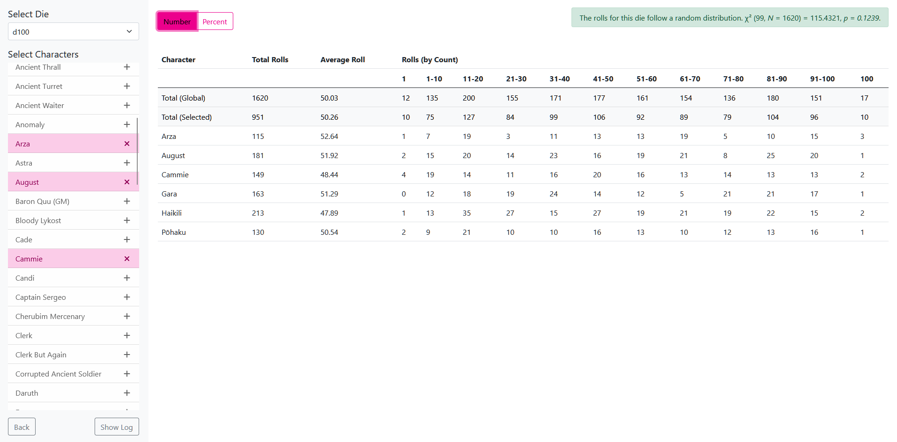

# Roll20Aggregator

This web app allows you to upload the HTML file of a Roll20 game chat log and view aggregate roll data for all characters in the game to answer such burning questions like, who was the luckiest? Who rolled the most crit fails?

## Features
On the home page, you can either an upload a chat log or view a demo using an example chat log.

Once a chat log has been uploaded and parsed, you can:
- Select one of the available dice rolled in the game for which to view data.
- Select the characters for which to view data.
- Select whether to view results in count or percentage form.
- View the results of a chi-square statistical analysis for the given dataset.
- View a log of rolled dice - useful for debugging.

## How does it work?
The parser works by checking each message element and parsing it for certain classes and attributes.

There are two chief classes of message to look out for: `rollresult`, which represents a roll block (the more pictographic result you get if you were to type `/r d20`); and `diceroll`, which represents an inline roll (the more compact, textual result you get if you were to type `[[d20]]`).

If such a class is found in the message, the HTML can be parsed for the number of faces and the number of dice, as well as the raw roll result (before modifiers). Note that there can be multiple rolls in a single message, and in rare cases a roll block can also contain an inline roll.

Complications arise in associating the result of the roll with who rolled it. Not all messages have author data. When the same user posts consecutive messages, subsequent messages omit author data. In such a case we must look for the first preceding message that contains author data.

More pressing is the issue of emote messages, messages sent with `/em` or `/me`. These messages do not neatly identify which character has sent the message. As humans, we can read a message like
> August the Second shoots a fireball.

and understand that the message was sent by a character named August the Second, but the parser has no way to do this. As exemplified above, we cannot simply assume that the first word of the message is the character name, as characters can have spaces in their name.

The parser attempts to get around this using the following strategy.
1. Save parsing of emote messages until after all other messages have been parsed.
2. When parsing non-emote messages, in which character names can be clearly identified, map avatar URLs to character names. Note that to our advantage, by default users will likely have different avatars!
3. Parse emote messages and use avatar data to aid in identifying the character.
   - In the ideal case, a character is uniquely identified.
   - If multiple characters share an avatar, we can search the emote message for the longest character name match.
   - If no avatar mapping was found, it likely means that this character has only ever typed emote messages. In this case, as mentioned above, it's impossible to determine what part of the message is the character name. Here the parser assumes that the character name is the first word.

## TO DO
- Files are currently read into memory in their entirety, which is not ideal for large files. There is logic in place to read and parse a file in chunks, but because we're parsing HTML, this gets complicated. This needs to be checked to make sure it works correctly.
- Add sorting to table.
- Add support for character to aliases. This would allow you to "group" characters and consider that group as one character, which is useful for instance if a character has changed their name.

## Technology
- Blazor (SPA framework)
- Bootstrap (CSS framework)
- HTMLAgilityPack (HTML parser)