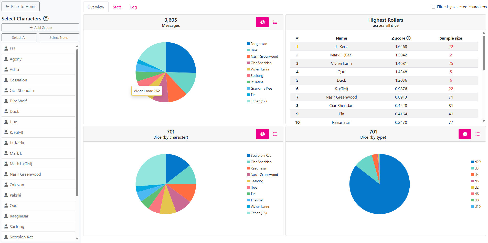

# Roll20Aggregator
Roll20 Aggregator is a web app that parses the chat log of a Roll20 game to display aggregate statistics and answers questions like, who wrote the most messages? Who rolled the most most 1s? Who was the luckiest? Were the virtual dice fair?



## Features
On the home page, you can either an upload a chat log or view a demo using an example game.

Once a chat log has been uploaded and parsed, you can:
- Pie chart and tabular representations of message and dice data
- Ranking of highest to lowest rollers, expressed as Z score across all dice
- Breakdown of roll results for individual die types in raw count or percent format, sortable by character or result column
- Chi square analysis to determine fairness of dice
- Creation of character groups to be considered jointly as single characters
- Roll log - useful to validate the parser with the chat log
- Filter displayed data by selected characters/groups

## Technology
- .NET 8
- Blazor
- Bootstrap 5.3.0
- Font Awesome 6.6.0
- AngleSharp 1.1.2: HTML parser
- Radzen.Blazor 5.1.3: Component library, used for pie charts
- Accord.Statistics 3.8.0: Statistics library, used for analysis

## How does it work?
### Parsing rolls
The parser works by checking the HTML of each `.message` div and parsing it for certain classes and attributes that identify rolls.

There are two chief classes of message to look out for: `.rollresult`, which recodesents a roll block (the pictographic result you get if you were to type `/r d20`); and `.diceroll`, which recodesents an inline roll (the more compact, textual result you get if you were to type `[[d20]]`).

In a roll block, the relevant roll information can be obtained from the `.dicegrouping` div. In the below example, we can see from the `.diceroll` div that a d6 was rolled, and from the `.didroll` div that a 3 was the raw roll. Importantly, this the value that was rolled, before any modifiers were applied.

```html
<div data-origindex="0" class="diceroll d6">
    <div class="dicon">
        <div class="didroll">3 </div>
        <div class="backing"> </div>
    </div>
</div>
```

Things are a little more messy for inline rolls. In the below example, we can see that all the roll information is contained in the `original-title` attribute of the `.inlinerollresult` span. The die type can be parsed from the `1d100` string, and the raw result can be found within the `.basicdiceroll` span. Note again that in this case we are interested in the 49 that was rolled, not the resulting 40 from a -9 being applied.

```html
<span class="inlinerollresult showtip tipsy-n-right"
        original-title="Rolling 1d100 - 9 = (<span class=&quot;basicdiceroll&quot;>49</span>)-9">
    40
</span>
```

Note that messages may contain multiple rolls, and the two types of rolls may rarely be combined: a roll block containing an inline roll.

Using the above methods, we can associate a die roll with the author of the message, which can typically be found in the `.by` span. This span will not be present in consecutive messages by the same user, so if not present, the message is associated with the previous author that was identified.

### Emote messages
Further complications to identifying authorship arise through emote message - that is, messages of the following format:
> August the Second shoots a fireball.

These messages do not have any HTML information to uniquely identify the author, so we must use the text content itself, which begins with the character name. However, while as a human we can read the above and understand that the character is named August the Second, the parser has no immediate way to know which words should be included in the character name.

The parser attempts to get around this using the following strategy:
1. Save parsing of emote messages until after all other messages have been parsed.
2. When parsing regular messages in which character names can be identified, map avatar URLs (found in `.avatar` div) to character names. Note that to our advantage, users will by default likely have different avatars.
3. After the first round of parsing has been completed, parse emote messages separately and use avatar data to aid in identifying the character.
   - In the ideal case, a character is uniquely identified.
   - If multiple characters share an avatar, search the emote message for the longest character name match.
   - If no avatar mapping was found, search the emote messages for longest match among all known character names.
   - If no match is found, it likely means that the character only ever typed emote messages. This is rare, and the parser must fall back to assuming that the first word of the emote message is the character name.

## Limitations
Because of the complexity of parsing, the aggregator cannot guarantee 100% coverage and accuracy.

The following are known limitations of the parser and the site as a whole:
- Private messages and description messages are not parsed.
- In rolls where multiple dice are rolled but only a certain number are kept, such as rolling with advantage in D&D 5e, all rolls are parsed.
- Special rolls such as FATE dice or compounding dice may not be parsed correctly.
- Individual die statistics can only be analyzed for standard die types: d2, d4, d6, d8, d10, d12, d20, d100.
- In tabletop games, dice results may be good or bad in different contexts. Sometimes higher is better, sometimes higher is worse. The "Highest Roller" ranking may therefore not represent actual "luck"; it only pertains to raw values and makes no presumptions about whether the outcome is good or bad.
- The site is intended for use on large, horizontal screens. It will not display correctly on mobile devices.